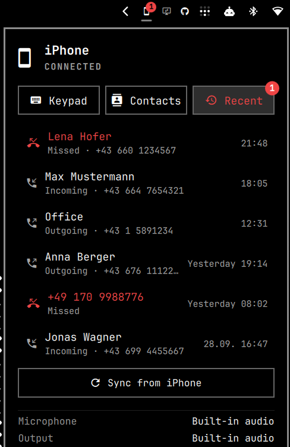

# iPhone Connect for Omarchy

Make and take your iPhone's phone calls on your Omarchy PC – with the PC's
microphone and speakers – and see the iPhone's notifications, battery and
music on your desktop. Everything goes over the Bluetooth connection the phone
already has for hands-free calls; no app on the iPhone, no cloud.



- **Incoming calls** ring on the PC and the iPhone at the same time; the panel
  opens with the caller's name and number. Answer on the PC → the call runs on
  the PC. Answer on the iPhone → it stays on the iPhone.
- **Dial** from a keypad, your **contacts** (with search) or the **recent calls**
  list – missed calls in red with a badge on the bar icon.
- **In a call:** timer, mute (clearly shown in red), keypad tones (DTMF), hang up,
  and *Take call on this PC* for a call that runs on the iPhone.
- **Noise suppression + echo cancellation** (WebRTC, built into PipeWire) removes
  fan noise; can be switched off in the panel.
- Calls you start on the iPhone stay on the iPhone. Optionally, music and videos
  stay on the iPhone too (the PC is not used as a Bluetooth speaker).
- **Notifications** (off until you switch them on): what arrives on the iPhone
  pops up on the PC and is listed in the panel, with app, title, text and time.
  Clearing one in the panel clears it on the iPhone. Apps can be listed without
  a pop-up.
- **Now playing**: title and artist of what the iPhone plays, with
  previous / play-pause / next.
- **Battery** level of the iPhone next to the connection status.

No oFono, no root daemon, no cloud: everything runs in your user session on
top of BlueZ and PipeWire's own telephony service (`org.pipewire.Telephony`).

## Requirements

- Omarchy (Arch) with Bluetooth
- PipeWire **1.4 or newer** with WirePlumber (for the telephony service)
- Packages: `bluez bluez-utils bluez-obex pipewire pipewire-pulse wireplumber python-gobject util-linux`
  (all from the official Arch repositories; the installer checks them)
- An iPhone (other phones with HFP should work too, but are untested)

## Install

```bash
omarchy plugin add https://github.com/Badr-Emil/omarchy-iphone-connect
~/.config/omarchy/plugins/io.github.badr-emil.iphone-connect/scripts/install.sh
```

The installer checks the system, lists missing packages (and installs them only
if you agree), sets up the user service `iphone-connect`, asks before adding the
optional WirePlumber drop-in, enables the bar icon and runs a diagnosis. It can
be run again at any time. If the service is missing, the panel shows a
**Finish setup** button that runs it.

### Pair your iPhone

```bash
~/.config/omarchy/plugins/io.github.badr-emil.iphone-connect/backend/iphone-connect pair
```

Then on the iPhone tap the PC's name in *Settings → Bluetooth* and confirm the
code on both sides. For caller names, contacts and recent calls, open the **(i)**
next to the PC on the iPhone and turn on **Sync Contacts**.

## Use

Click the iPhone icon in the bar. Middle-click it to hang up.

Everything the panel does is also available on the command line
(`backend/iphone-connect --help`):

```text
iphone-connect status | devices | pair | connect | disconnect
iphone-connect call +43123456789 | answer | reject | hangup | redial | take
iphone-connect mute [on|off] | tones 123# | volume 70
iphone-connect contacts [sync|list|lookup NUMBER|clear]
iphone-connect history [sync|seen] [--json]
iphone-connect noise on|off | ringtone on|off [--file FILE] | notifications on|off
iphone-connect mirror [on|off|list|dismiss UID|dismiss all]     # iPhone notifications
iphone-connect mirror mute|unmute APP_ID | mirror popups on|off
iphone-connect media play|pause|toggle|next|previous
iphone-connect diagnostics            # numbers and addresses masked by default
```

## Settings

`~/.config/iphone-connect/config.json` (changed with the commands above):

| Key | Default | Meaning |
|---|---|---|
| `noiseSuppression` | `true` | WebRTC noise suppression + echo cancellation during calls |
| `ringtone` / `ringtoneFile` | `true` / freedesktop *phone-incoming-call* | ring on the PC for incoming calls |
| `notifications` | `true` | desktop notification for incoming calls (click = answer) |
| `mirror` | `false` | show the iPhone's notifications on this PC |
| `mirrorToasts` | `true` | pop-ups for mirrored notifications (the panel lists them either way) |
| `mirrorMutedApps` | `[]` | app ids that are listed but never pop up |

Bar widget settings (Omarchy bar settings): open the panel on incoming calls,
hide the icon while no iPhone is connected.

## iPhone notifications

Open the **Notifications** tab in the panel and press *Show iPhone
notifications*, or run `iphone-connect mirror on`. Nothing is read from the
phone before that.

How it works: the iPhone offers Apple's Notification Center Service (ANCS) and
Media Service (AMS) on the Bluetooth link that hands-free calling already
uses. The background service opens one data channel on that link and keeps it
while the phone is connected. No second pairing and no root rights are needed.

Good to know:

- Notifications that are already on the iPhone when the PC connects are listed
  but do not pop up again. Incoming calls do not pop up twice either; they ring
  through the call part of this plugin.
- You can clear a notification, not answer it: the service offers no way to
  reply to a message.
- The iPhone accepts a single data channel. If the panel says the iPhone
  refused it, switch Bluetooth off and on in the iPhone's *Settings* (not the
  Control Centre) and wait for it to reconnect.
- If nothing arrives, open *Settings → Bluetooth → (i)* next to the PC on the
  iPhone and turn on sharing of system notifications.

## Privacy

- Contacts (names and numbers only), call history and the local call log are
  stored in `~/.local/share/iphone-connect/`, readable only by you (mode 600).
- Mirrored notifications are personal: their texts are held in memory and in
  one file in your runtime directory (`$XDG_RUNTIME_DIR/iphone-connect/mirror.json`,
  in memory, mode 600, gone at logout). They are never written to the journal;
  `status` and `diagnostics` only report how many there are. Switching the
  mirror off empties the file.
- Nothing is sent anywhere; there is no telemetry and no network access.
- `iphone-connect diagnostics` masks phone numbers and Bluetooth addresses.

## Limitations (standard HFP/PBAP, said plainly)

- Operator name and signal strength are not shown: PipeWire reads them but does
  not export them on D-Bus.
- The iPhone's Bluetooth call history (PBAP) can lag behind the phone's own list;
  calls seen live by the PC are recorded locally and merged in.
- Apple-only features (Continuity, FaceTime, Wi-Fi call relay) are not used.
- Notifications can be shown and cleared, not answered. SMS/iMessage cannot be
  sent from the PC.

## Uninstall

```bash
~/.config/omarchy/plugins/io.github.badr-emil.iphone-connect/scripts/uninstall.sh
omarchy plugin remove io.github.badr-emil.iphone-connect
```

The uninstaller only removes what the installer set up: the service unit that
links into this plugin folder, and the WirePlumber drop-in if the installer
wrote it and it is unchanged since. A service or drop-in of the same name that
is not from this plugin is left untouched. It asks before deleting your local
data.

## Development

```bash
/usr/bin/python3 -B -m unittest discover -s tests   # no hardware needed: a simulated iPhone answers
journalctl --user -u iphone-connect -f      # backend log
journalctl --user -t iphone-connect         # actions from the panel/CLI
```

See [docs/architecture.md](docs/architecture.md),
[docs/feasibility.md](docs/feasibility.md) and
[docs/troubleshooting.md](docs/troubleshooting.md).

## License

MIT
